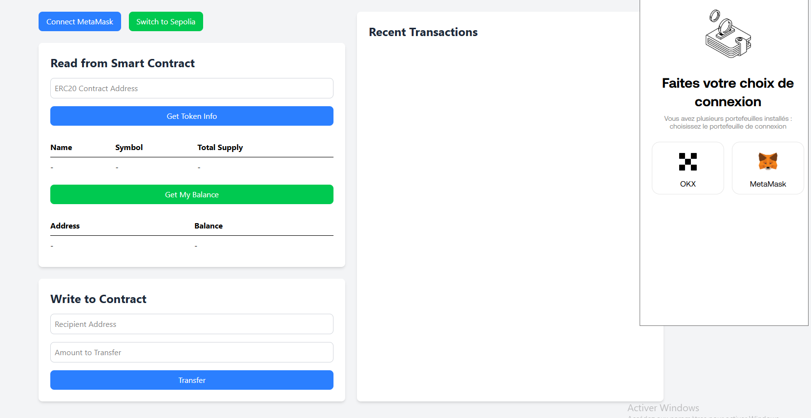
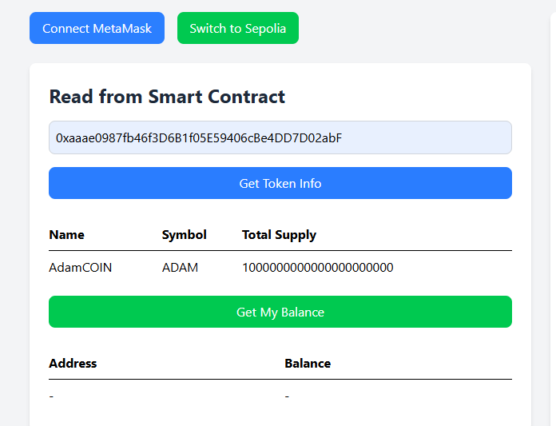
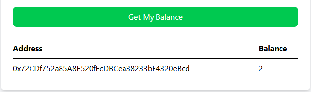
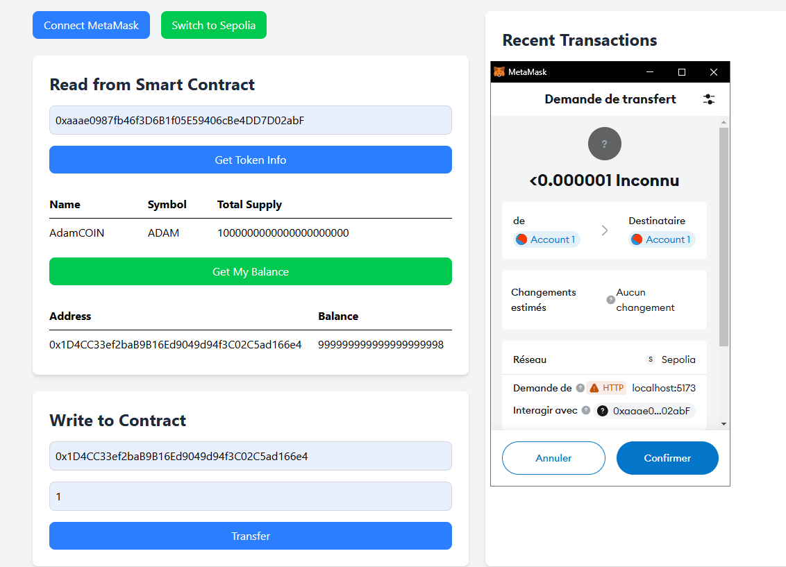
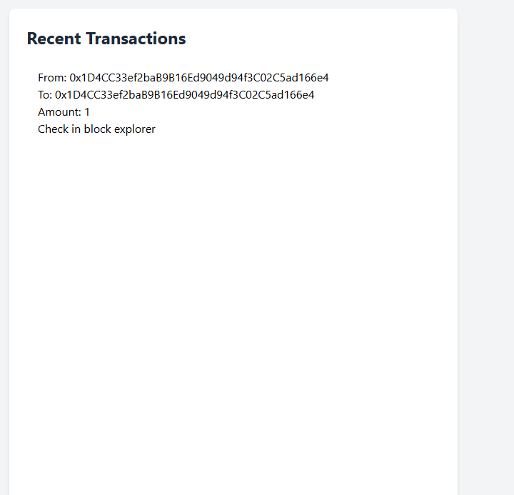

# ERC20 Token Interaction App

This is a React application that allows users to interact with ERC20 tokens on the Ethereum blockchain. Users can connect their MetaMask wallet, switch to the Sepolia testnet, read token information, check their balance, and transfer tokens.

## Features

- **Connect MetaMask**: Connect your MetaMask wallet to the application.
- **Switch to Sepolia**: Switch the network to Sepolia testnet.
- **Read Token Info**: Fetch and display token information (name, symbol, total supply).
- **Check Balance**: Check the balance of the connected wallet.
- **Transfer Tokens**: Transfer tokens to another address.

## Screenshots

### Connect MetaMask and Switch Network



### Read Token Information



### Check Balance



### Transfer Tokens



### Recent Transactions



## Prerequisites

Before you begin, ensure you have the following installed:

- [Node.js](https://nodejs.org/) (v16 or higher)
- [pnpm](https://pnpm.io/) (Package manager)
- [MetaMask](https://metamask.io/) (Browser extension)

## Installation

1. **Clone the repository**:

   ```bash
   git clone https://github.com/your-username/your-repo-name.git
   cd your-repo-name

   ```

2. **Install dependencies**:

   ```bash
    pnpm install
    pnpm dev

   ```

## Structure

```bash
ethswap-vite/
├── public/
├── src/
│   ├── components/
│   │   ├── ErrorMessage.jsx
│   │   └── TxList.jsx
│   ├── contracts/
│   │   └── erc20abi.json
│   ├── App.jsx
│   ├── main.jsx
│   └── index.css
├── .env
├── .gitignore
├── package.json
├── pnpm-lock.yaml
├── README.md
└── vite.config.js
```
